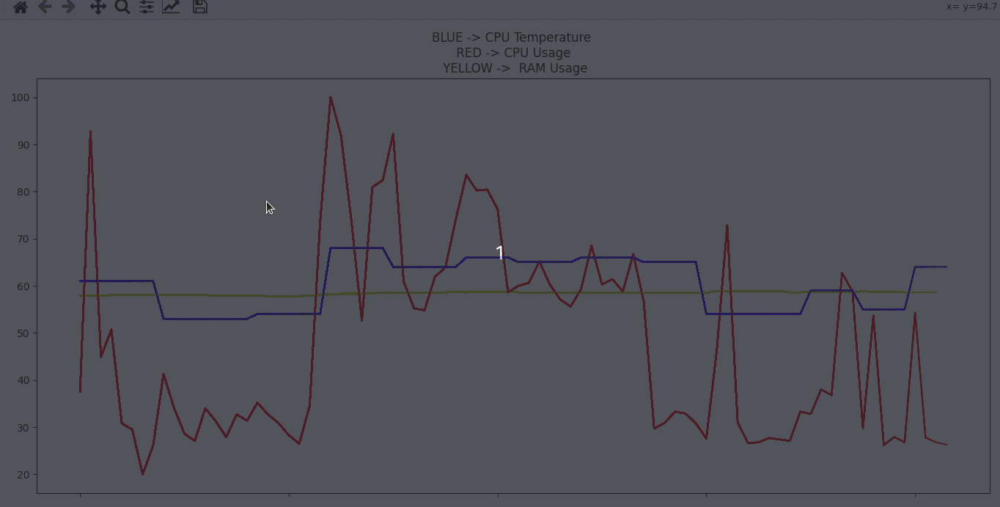
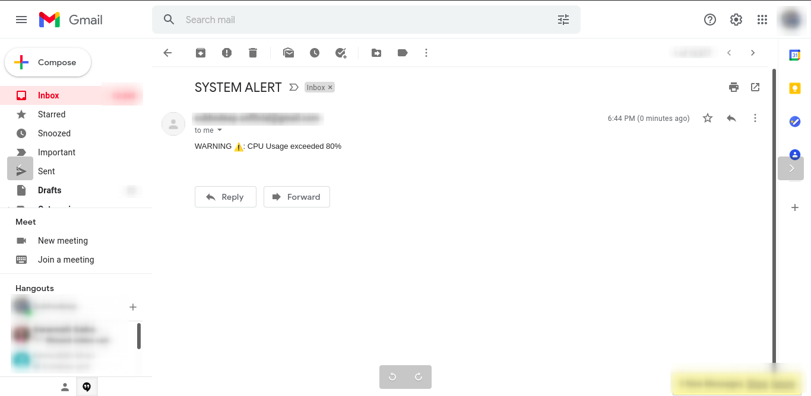

# Syseye
*by Subhodeep Sarkar*

**System monitoring and alerting tool made with Python**

This tool can show the system usage in graph format.
- Red line indicates CPU usage percentage
- Blue line indicates CPU temperature in degrees Celsius
- Yellow line indicates RAM usage percentage

In case the threshold values exceeds, the admin will receive a system alert through email.
By default all the threshold values are above 80.

*The sender email & password, receipent email and threshold values can be configured*

## Modules used:
- Matplotlib.pyplot
- Matplotlib.animation
- Psutil
- Smtplib
- Email.message
- Mimetypes
- Os

## Configuration:
- LINE 10: Change sender email ``sender = example@gmail.com`` 
- LINE 11: Change sender password ``password = examplepassword``
- LINE 42, 55, 68: Change receipent email ``create_and_send_email("receipentemail@gmail.com"...``

## Usage:
Run ``python main.py`` on the terminal
